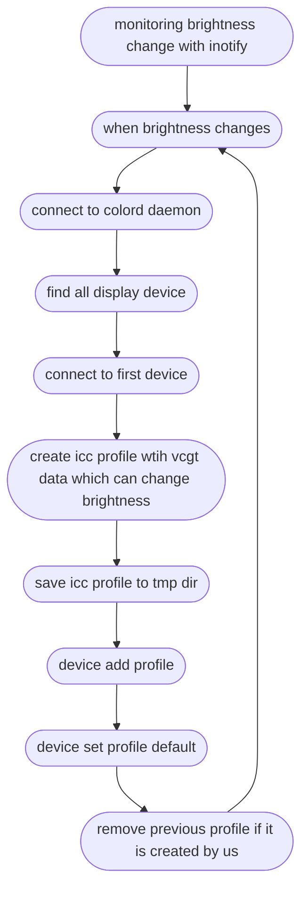

# icc-brightness

Monitoning brightness change and
control OLED display brightness by applying ICC color profiles

## Compile & install

```sh
# setup compiling enviroment
sudo apt install build-essential liblcms2-dev libcolord-dev
# compile
make
# install
make install
```

## How does this program work



## Extra

vscode clangd dev

```sh
bear -- gcc -o icc-brightness ./src/icc-brightness.c $(pkg-config --cflags --libs colord lcms2 uuid) -Wall
```

inotify example

- <https://github.com/asadzia/Inotify-API/blob/master/Inotify.c>

get brightness example

- <https://github.com/baskerville/backlight/blob/master/backlight.c>

change brightness by creating icc with vcgt data examples

- <https://github.com/udifuchs/icc-brightness>
- <https://github.com/zb3/gnome-gamma-tool>

colord

- <https://github.com/hughsie/colord>

getopt_long example

- <https://www.gnu.org/software/libc/manual/html_node/Getopt-Long-Option-Example.html>
